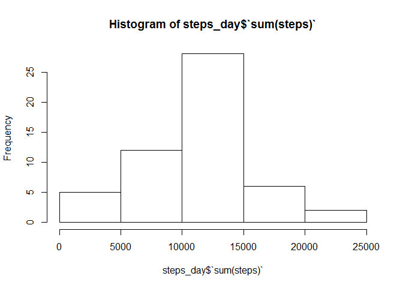
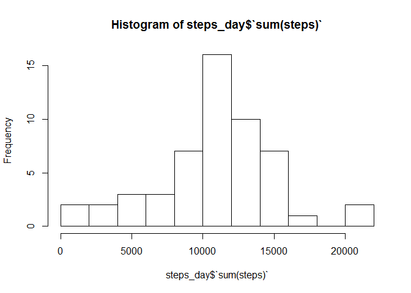
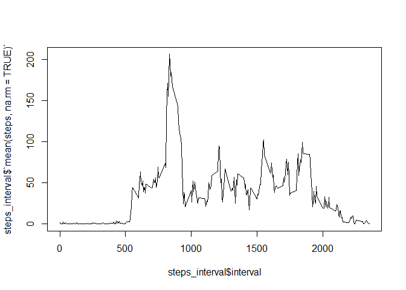
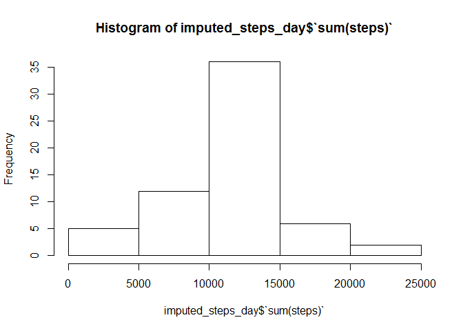
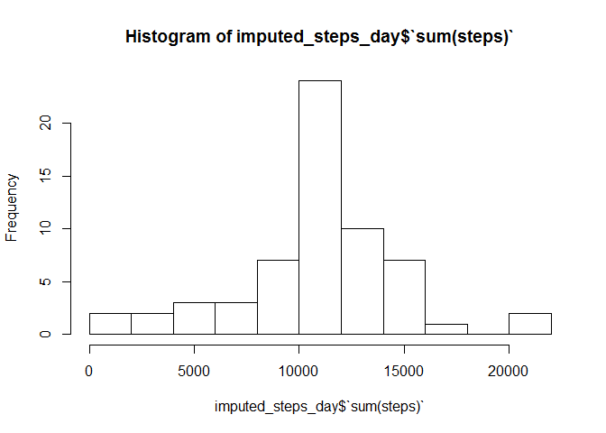
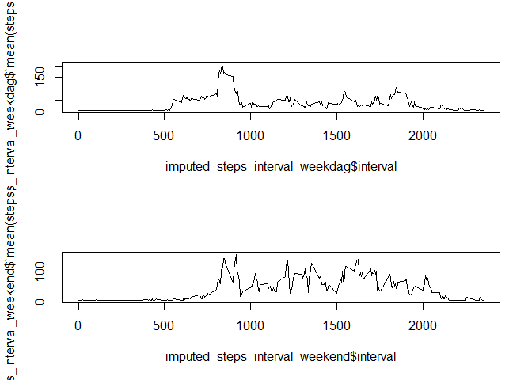

# Reproducible Research: Peer Assessment 1
Dominique Gijzen  
15 mei 2016  
***
## Used packages

```r
library("dplyr")
```

```
## 
## Attaching package: 'dplyr'
```

```
## The following objects are masked from 'package:stats':
## 
##     filter, lag
```

```
## The following objects are masked from 'package:base':
## 
##     intersect, setdiff, setequal, union
```

## Loading and preprocessing the data
A primary check to verify the "activity.csv" file exists and, when not, reading the csv 
file into a dataframe named "activity".

```r
if (!file.exists("activity.csv"))
      unzip("activity.zip")
activity <- read.csv("activity.csv")
```

### First data exploration
The head, summary and structure of the dataframe are shown.

```r
head(activity)
```

```
##   steps       date interval
## 1    NA 2012-10-01        0
## 2    NA 2012-10-01        5
## 3    NA 2012-10-01       10
## 4    NA 2012-10-01       15
## 5    NA 2012-10-01       20
## 6    NA 2012-10-01       25
```

```r
summary(activity)
```

```
##      steps                date          interval     
##  Min.   :  0.00   2012-10-01:  288   Min.   :   0.0  
##  1st Qu.:  0.00   2012-10-02:  288   1st Qu.: 588.8  
##  Median :  0.00   2012-10-03:  288   Median :1177.5  
##  Mean   : 37.38   2012-10-04:  288   Mean   :1177.5  
##  3rd Qu.: 12.00   2012-10-05:  288   3rd Qu.:1766.2  
##  Max.   :806.00   2012-10-06:  288   Max.   :2355.0  
##  NA's   :2304     (Other)   :15840
```

```r
str(activity)
```

```
## 'data.frame':	17568 obs. of  3 variables:
##  $ steps   : int  NA NA NA NA NA NA NA NA NA NA ...
##  $ date    : Factor w/ 61 levels "2012-10-01","2012-10-02",..: 1 1 1 1 1 1 1 1 1 1 ...
##  $ interval: int  0 5 10 15 20 25 30 35 40 45 ...
```

* The 'steps' value has a lot of NA's. There are also zero (0) values. So it doesn't sound
logical that the NA's symbolize 0 steps are counted. This should probably be verified
but the assessment describes that the NA's have to be taken care of in a later step.  
* The 'date' value is not imported as a real date but as a integer. This has to be reformatted.
In addition: the 'date' values have 288 doubles per date. This might indicate that there
are 288 subjects. But there is no such thing as a subject identifier.  
* The 'interval' value is an integer. This value describes the time which the interval 
starts. If necessary, this could be transformed to a time value. But it seems like 
the assessment doesn't use this value as a time value.

### Preprocessing the data
The 'date' value is transformed to a real date value.

```r
activity$date <- as.Date(activity$date, format = "%Y-%m-%d")
summary(activity)
```

```
##      steps             date               interval     
##  Min.   :  0.00   Min.   :2012-10-01   Min.   :   0.0  
##  1st Qu.:  0.00   1st Qu.:2012-10-16   1st Qu.: 588.8  
##  Median :  0.00   Median :2012-10-31   Median :1177.5  
##  Mean   : 37.38   Mean   :2012-10-31   Mean   :1177.5  
##  3rd Qu.: 12.00   3rd Qu.:2012-11-15   3rd Qu.:1766.2  
##  Max.   :806.00   Max.   :2012-11-30   Max.   :2355.0  
##  NA's   :2304
```

```r
str(activity)
```

```
## 'data.frame':	17568 obs. of  3 variables:
##  $ steps   : int  NA NA NA NA NA NA NA NA NA NA ...
##  $ date    : Date, format: "2012-10-01" "2012-10-01" ...
##  $ interval: int  0 5 10 15 20 25 30 35 40 45 ...
```

***

## What is mean total number of steps taken per day?

###Create totals per day


```r
activity_day <- group_by(activity, date)
steps_day <- summarise(activity_day, sum(steps))
```

###Show histogram with totals

```r
hist(steps_day$`sum(steps)`)
```

<!-- -->

```r
hist(steps_day$`sum(steps)`, breaks=15)
```

<!-- -->

###Calculate and report the mean and median of the total number of steps taken per day

```r
mean(steps_day$`sum(steps)`, na.rm = TRUE)
```

```
## [1] 10766.19
```

```r
median(steps_day$`sum(steps)`, na.rm = TRUE)
```

```
## [1] 10765
```

***

## What is the average daily activity pattern?

### Time series plot


```r
activity_interval <- group_by(activity, interval)
steps_interval <- summarise(activity_interval, mean(steps, na.rm = TRUE))
plot( steps_interval$interval, steps_interval$`mean(steps, na.rm = TRUE)`, type = "l")
```

<!-- -->

### 5 Minute interval with max steps


```r
steps_interval$interval[steps_interval$`mean(steps, na.rm = TRUE)`==max(steps_interval$`mean(steps, na.rm = TRUE)`)]
```

```
## [1] 835
```

***

## Imputing missing values

### Number of rows with missing values(steps)


```r
nrow(activity[is.na(activity$steps),])
```

```
## [1] 2304
```

### Strategy to impute missing values

To think about a startegy to impute the missing values, we need to have more 
information about the NA's. In particular the locations of the NA's.


```r
activity_na <- activity[is.na(activity$steps),]
summary(activity_na)
```

```
##      steps           date               interval     
##  Min.   : NA    Min.   :2012-10-01   Min.   :   0.0  
##  1st Qu.: NA    1st Qu.:2012-10-26   1st Qu.: 588.8  
##  Median : NA    Median :2012-11-06   Median :1177.5  
##  Mean   :NaN    Mean   :2012-11-01   Mean   :1177.5  
##  3rd Qu.: NA    3rd Qu.:2012-11-11   3rd Qu.:1766.2  
##  Max.   : NA    Max.   :2012-11-30   Max.   :2355.0  
##  NA's   :2304
```

Based on this quick analysis, it seems that the missing NA are in fact missing 
days. Since the NA's are missing days, it is not possible to calculate a day average 
and use that to impute the NA's. An alternative is to impute with the column mean.

### Impute NA's with column mean


```r
activity_imputed <- activity
activity_imputed$steps[is.na(activity_imputed$steps)] <- mean(activity$steps, na.rm = TRUE)
summary(activity_imputed)
```

```
##      steps             date               interval     
##  Min.   :  0.00   Min.   :2012-10-01   Min.   :   0.0  
##  1st Qu.:  0.00   1st Qu.:2012-10-16   1st Qu.: 588.8  
##  Median :  0.00   Median :2012-10-31   Median :1177.5  
##  Mean   : 37.38   Mean   :2012-10-31   Mean   :1177.5  
##  3rd Qu.: 37.38   3rd Qu.:2012-11-15   3rd Qu.:1766.2  
##  Max.   :806.00   Max.   :2012-11-30   Max.   :2355.0
```

### Make a new histogram, mean and median

#### Create totals per day

```r
activity_imputed_day <- group_by(activity_imputed, date)
imputed_steps_day <- summarise(activity_imputed_day, sum(steps))
```

#### Show histogram with totals

```r
hist(imputed_steps_day$`sum(steps)`)
```

<!-- -->

```r
hist(imputed_steps_day$`sum(steps)`, breaks=15)
```

<!-- -->

#### Calculate and report the mean and median of the total number of steps taken per day

```r
mean(imputed_steps_day$`sum(steps)`, na.rm = TRUE)
```

```
## [1] 10766.19
```

```r
median(imputed_steps_day$`sum(steps)`, na.rm = TRUE)
```

```
## [1] 10766.19
```

##### Do these values differ from the estimates from the first part of the assignment?  
Yes, the frequencies changed because the NA's were ingnored in the first case but 
are now imputed with a average. This affects the frequencies and thus the histogram.

##### What is the impact of imputing missing data on the estimates of the total daily number of steps?  
The mean is still the same because the NA's are imputed by the mean. This does 
not affect the mean. But the median takes into account the frequencies and is slight 
affected by +1.69.

***

## Are there differences in activity patterns between weekdays and weekends?

### Add weekdays information imputed data


```r
weekdays1 <- c("maandag", "dinsdag", "woensdag", "donderdag", "vrijdag")
activity_imputed$day <- factor((weekdays(activity_imputed$date) %in% weekdays1), levels=c(FALSE, TRUE), labels=c('weekend', 'weekdag'))
str(activity_imputed)
```

```
## 'data.frame':	17568 obs. of  4 variables:
##  $ steps   : num  37.4 37.4 37.4 37.4 37.4 ...
##  $ date    : Date, format: "2012-10-01" "2012-10-01" ...
##  $ interval: int  0 5 10 15 20 25 30 35 40 45 ...
##  $ day     : Factor w/ 2 levels "weekend","weekdag": 2 2 2 2 2 2 2 2 2 2 ...
```

### Time series plot


```r
activity_imputed_interval <- group_by(activity_imputed, interval, day)
imputed_steps_interval <- summarise(activity_imputed_interval, mean(steps, na.rm = TRUE))
imputed_steps_interval_weekdag <- imputed_steps_interval[imputed_steps_interval$day=="weekdag",]
imputed_steps_interval_weekend <- imputed_steps_interval[imputed_steps_interval$day=="weekend",]
par(mfrow=c(2,1))
plot(imputed_steps_interval_weekdag$interval, imputed_steps_interval_weekdag$`mean(steps, na.rm = TRUE)`, type = "l")
plot(imputed_steps_interval_weekend$interval, imputed_steps_interval_weekend$`mean(steps, na.rm = TRUE)`, type = "l")
```

<!-- -->

In this plot, it is clearly indicated that there is a difference between weekdays 
and weekends. 
